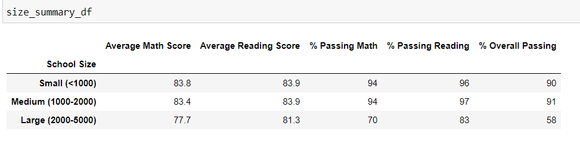

## **OVERVIEW OF THE ANALYSIS**
This analysis was performed after the complaints that some academic dishonesty was committed in grade *9th* results of **Math** and **Reading** subjects in **Thomas High School** hence the data was replaced by **NaN** in these two results of the said school / grade and remaining data was analysed.
## **RESULTS** ##
The analysis has been performed on before and after replacing grade 9th results in **Thomas High School** and different parameters were studied to get the below findings:

* **How is the *District Summary* affected**

Below are the screen shots of the District Summary before and after replacing 9th grade results.
#### **Before** ####

#### **After**

This is evident from this anlayis that when we replaced Math and Reading scores from grade 9th of Thomas High School with **NaN** , the average scores in *Math* is decreased with a very little number (*Average Math* from 79% to 78.9% ) whereas there is no change in *Average Reading* score and it remain at 81.9%. The reason of the small or no difference is the number of students of grade 9th in Thomas High School was only 461 and this small number didnt make a huge dent in big data set of 39170 students.

* **How is the *School Summary* affected**

There is no change in *School Summary* results except results of *Thomas High School* reason being that the change in the data was made in only Thomas High School. The effects of this change will be discussed later. Below imgaes support this statement.
**Before**

**After**

* **Affects on *Thomas High School* performance after replacing *Math* and *Reading* scores**

When scores of 9th graders were removed, the relevant scores of Thomas High School were changed by very small percentage points because number of 9th grade students is very less as compared to overall number. In both scenarios, Thomas High School remains at the number 2 position of Top Schools. This is evident from below images:

**Before**

**After**

* **Effects of replacing 9th grade scores on following:**

**A- Math & Reading Scores by grade**

There is no change in *Math* and *Reading* scores in each grade except grade 9th students of Thomas High School. These grades are shown by **NaN** under these subjects as shown in the below images after the scores were replaced.

**Reading Scores After Replacement**

**Math Scores After Replacement**

**B- Scores By School Spending**

There is no change in *School Spending* per student before or after the replacement of scores. The reason is that the total budget and number of students are same. This is evident from below images:

**Before**

**After**

**C- Scores By School Size**

Again there is no change in *School Size* parameter before or after replacement of 9th grade scores. The data anlaysis images show the fact.

**Before**

**After**

**D- Scores By School Type**

There is no change in *School Type* parameter as well. The reason is same which is small number of 9th graders. The images below say the same.

**Before**

**After**

## **SUMMARY**

Though by replacing scores in 9th graders in Thomas High School (THS) has not made a big change in overall District School Analysis but it has made signifant difference in Thomas High School's own results. There are below four major changes:

1- Number of Students passed in THS has decreased from 1635 to 1174 after taking out 9th graders.

2- Percentage of students passed *Math* in THS has been decreased to 66.91% from 93+%.

3- Percentage of students passed *Reading* in THS has been reduced to 69.66% from 97+%

4- Overall passing ratio in THS has been reduced to 65.07% from 90+%.

The above three results are evident from below image.

